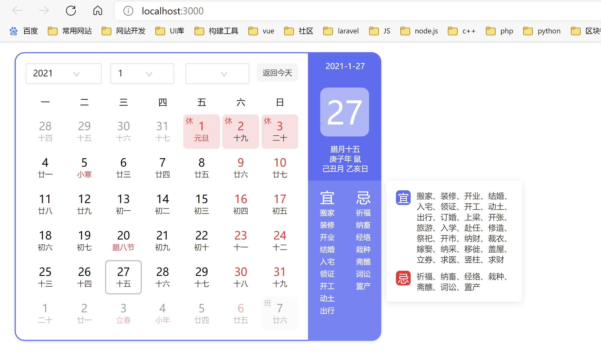

# vue-baidu-calendar
基于vue3实现的百度日历组件。宜忌算法尚未实现，欢迎pr。
 ## 安装
```
$ npm install vue-baidu-calendar --save
```

## 使用
mian.js
```js
import { createApp } from 'vue'
import App from './App.vue'
import BaiduCalendar from "vue-baidu-calendar"
const app=createApp(App)
app.use(BaiduCalendar)
app.mount('#app')

```
App.vue
``` html
<template>
<!-- 要给外层div指定合适的宽度 -->
   <div style="width:600px;margin-top:16px;margin-left:16px">
      <baidu-calendar @change="change" :date="date" :range="range"/>
  </div>
</template>

<script setup>
import {  ref } from "vue";
//date改变触发事件
const change = (obj)=>{
  console.log('obj',obj)
}
const date = ref("2021-1-27") //设置日期，若不设置，则默认为今天
const range = [2015,2025] //设置年份烦问 默认[2010,2030]

</script>

<style></style>

```
## 演示

